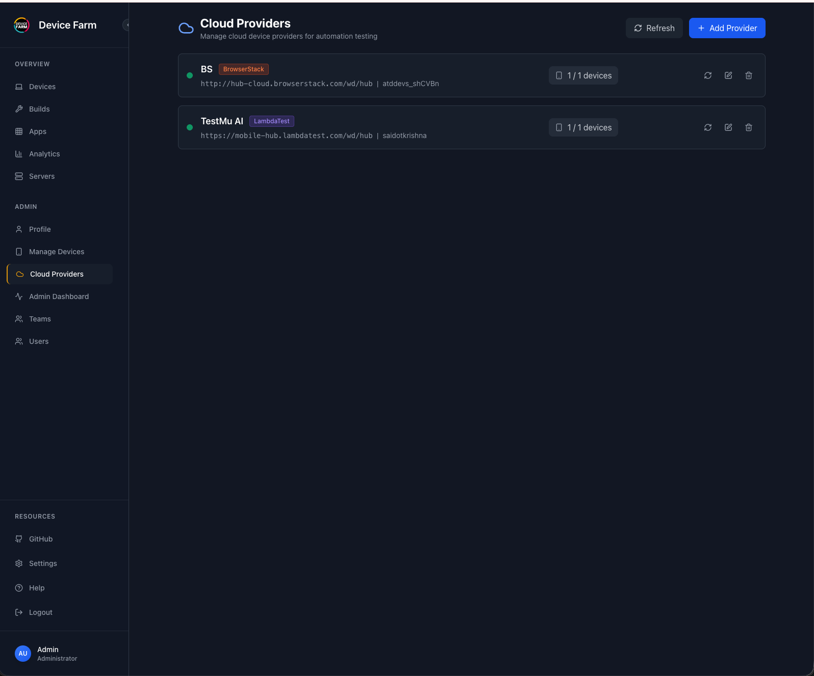
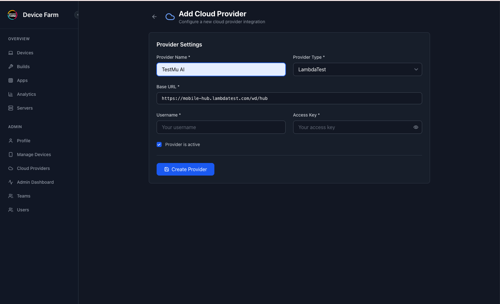
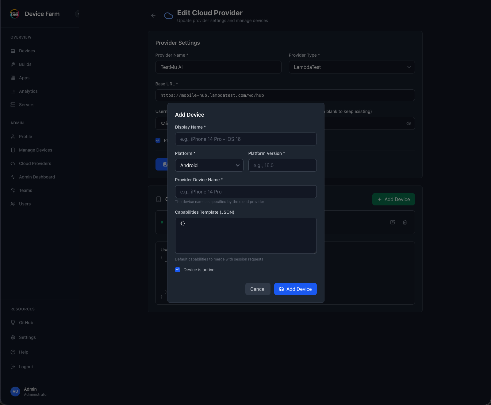
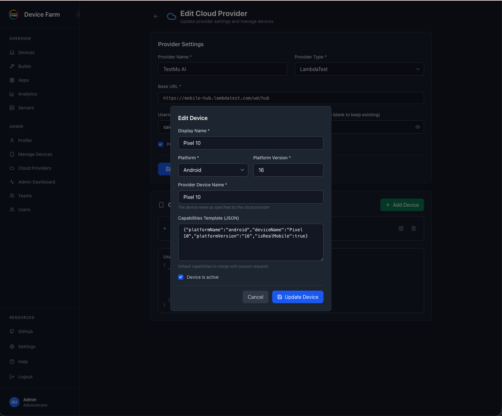
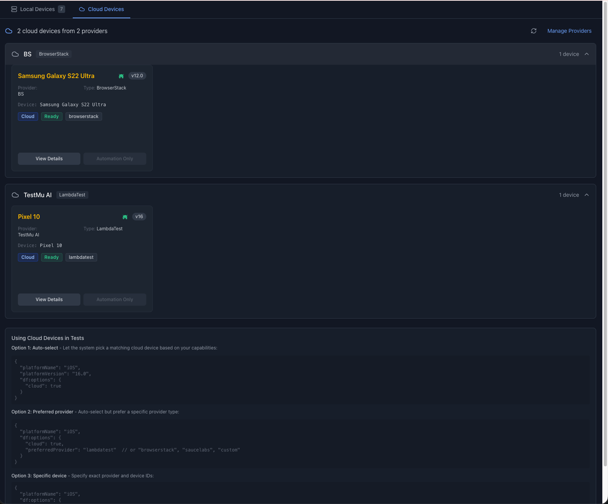
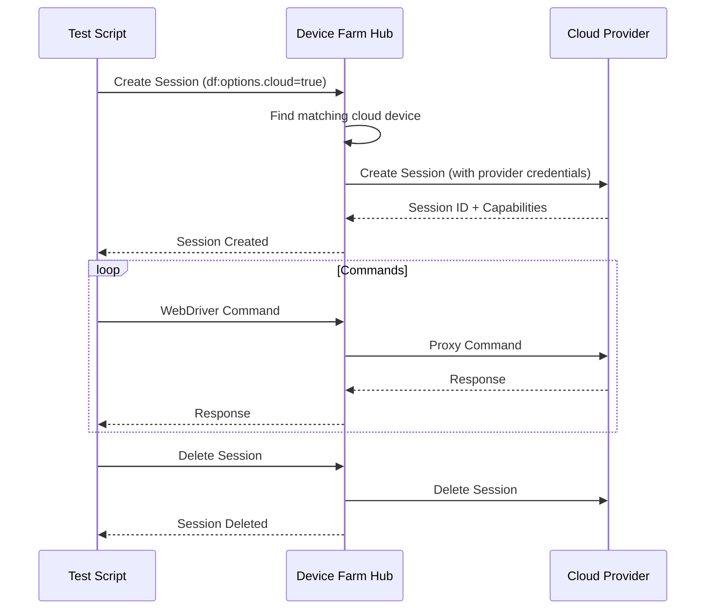

# Cloud Execution

Device Farm supports integration with cloud device providers like **TestMu AI** (formerly LambdaTest), **BrowserStack**, **SauceLabs**, and custom WebDriver endpoints. This allows you to seamlessly run your automation tests on cloud devices alongside your local device farm.

## Overview

Cloud execution in Device Farm enables you to:

- Run tests on cloud providers without changing your test code
- Combine local and cloud devices in your testing strategy
- Centrally manage cloud provider credentials and device configurations
- Track cloud sessions alongside local sessions in the dashboard

!!! info "Automation Only"
    Cloud devices are available for **automation testing only**. Manual/live testing sessions are not supported for cloud devices.

## Supported Providers

| Provider | Type Key | Base URL Example |
|----------|----------|------------------|
| TestMu AI (formerly LambdaTest) | `lambdatest` | `https://mobile-hub.lambdatest.com/wd/hub` |
| BrowserStack | `browserstack` | `https://hub-cloud.browserstack.com/wd/hub` |
| SauceLabs | `saucelabs` | `https://ondemand.us-west-1.saucelabs.com/wd/hub` |
| Custom | `custom` | Any WebDriver-compatible endpoint |

---

## Configuring Cloud Providers

### Step 1: Access Cloud Providers

Navigate to **Admin** → **Cloud Providers** in the sidebar.



This page displays all configured cloud providers for your organization. Each provider shows:

- Provider name and type
- Base URL and username
- Number of configured devices
- Actions: Test connection, Edit, Delete

### Step 2: Add a Cloud Provider

Click **+ Add Provider** to configure a new cloud provider.



Fill in the provider settings:

| Field | Description | Example |
|-------|-------------|---------|
| **Provider Name** | A friendly name for this provider | `TestMu AI`, `Production BrowserStack` |
| **Provider Type** | Select from dropdown | `LambdaTest`, `BrowserStack`, `SauceLabs`, `Custom` |
| **Base URL** | WebDriver hub URL for the provider | `https://mobile-hub.lambdatest.com/wd/hub` |
| **Username** | Your cloud provider username/email | `your-username` |
| **Access Key** | Your cloud provider API key/access key | `your-access-key` |
| **Provider is active** | Enable/disable this provider | Checked |

Click **Create Provider** to save.

!!! tip "Finding Your Credentials"
    - **TestMu AI**: Profile → Account Settings → Password & Security
    - **BrowserStack**: Account → Settings → Automate
    - **SauceLabs**: Account → User Settings

### Step 3: Add Cloud Devices

After creating a provider, you need to add device configurations. Click on the provider to edit it, then click **+ Add Device**.



Configure the device:

| Field | Description | Example |
|-------|-------------|---------|
| **Display Name** | Friendly name shown in Device Farm | `Pixel 10`, `iPhone 14 Pro - iOS 16` |
| **Platform** | `Android` or `iOS` | `Android` |
| **Platform Version** | OS version number | `16`, `16.0` |
| **Provider Device Name** | Device name as specified by the cloud provider | `Pixel 10`, `iPhone 14 Pro` |
| **Capabilities Template** | Default capabilities merged with test requests (JSON) | See below |
| **Device is active** | Enable/disable this device | Checked |

#### Example Device Configuration



**Capabilities Template example for TestMu AI Android:**

```json
{
  "platformName": "android",
  "deviceName": "Pixel 10",
  "platformVersion": "16",
  "isRealMobile": true
}
```

**Capabilities Template example for BrowserStack iOS:**

```json
{
  "platformName": "ios",
  "deviceName": "iPhone 14 Pro",
  "platformVersion": "16",
  "bstack:options": {
    "deviceName": "iPhone 14 Pro",
    "osVersion": "16"
  }
}
```

---

## Viewing Cloud Devices

Cloud devices appear in the **Devices** page under the **Cloud Devices** tab.



The cloud devices tab shows:

- Devices grouped by provider
- Device name, platform, and version
- Provider type badge
- Status (Ready/Busy)
- Active session ID when in use

---

## Using Cloud Devices in Tests

There are three ways to target cloud devices in your automation tests:

### Option 1: Auto-Select (Recommended)

Let Device Farm automatically select a matching cloud device based on your capabilities:

```json
{
  "platformName": "iOS",
  "platformVersion": "16.0",
  "df:options": {
    "cloud": true
  }
}
```

Device Farm will find a cloud device matching your `platformName` and `platformVersion`.

### Option 2: Preferred Provider

Auto-select but prefer a specific provider type:

```json
{
  "platformName": "iOS",
  "df:options": {
    "cloud": true,
    "preferredProvider": "lambdatest"
  }
}
```

Valid values for `preferredProvider`:

- `lambdatest` (TestMu AI)
- `browserstack`
- `saucelabs`
- `custom`

If no matching device is found on the preferred provider, Device Farm falls back to other providers.

### Option 3: Specific Device

Target an exact provider and device by their IDs:

```json
{
  "platformName": "iOS",
  "df:options": {
    "cloudProviderId": "<provider-uuid>",
    "cloudDeviceId": "<device-uuid>"
  }
}
```

You can find the provider and device IDs by clicking **View Details** on a cloud device card.

---

## Test Code Examples

### Java (Appium)

```java
DesiredCapabilities caps = new DesiredCapabilities();
caps.setCapability("platformName", "Android");
caps.setCapability("appium:platformVersion", "13");
caps.setCapability("appium:app", "https://example.com/app.apk");

// Device Farm cloud options
Map<String, Object> dfOptions = new HashMap<>();
dfOptions.put("cloud", true);
dfOptions.put("preferredProvider", "lambdatest"); // TestMu AI
dfOptions.put("accessKey", "your-device-farm-access-key");
caps.setCapability("df:options", dfOptions);

// Connect to Device Farm hub (not directly to cloud provider)
AndroidDriver driver = new AndroidDriver(
    new URL("https://your-device-farm-hub.com/wd/hub"),
    caps
);
```

### Python (Appium)

```python
from appium import webdriver
from appium.options.common import AppiumOptions

options = AppiumOptions()
options.set_capability("platformName", "Android")
options.set_capability("appium:platformVersion", "13")
options.set_capability("appium:app", "https://example.com/app.apk")

# Device Farm cloud options
options.set_capability("df:options", {
    "cloud": True,
    "preferredProvider": "lambdatest",  # TestMu AI
    "accessKey": "your-device-farm-access-key"
})

# Connect to Device Farm hub
driver = webdriver.Remote(
    command_executor="https://your-device-farm-hub.com/wd/hub",
    options=options
)
```

### JavaScript (WebdriverIO)

```javascript
// wdio.conf.js
exports.config = {
  hostname: 'your-device-farm-hub.com',
  port: 443,
  path: '/wd/hub',
  protocol: 'https',

  capabilities: [{
    platformName: 'Android',
    'appium:platformVersion': '13',
    'appium:app': 'https://example.com/app.apk',
    'df:options': {
      cloud: true,
      preferredProvider: 'browserstack',
      accessKey: 'your-device-farm-access-key'
    }
  }]
};
```

---

## How It Works

When you request a cloud session:

1. **Session Request**: Your test sends a session request to Device Farm hub
2. **Device Selection**: Device Farm selects a matching cloud device based on capabilities
3. **Cloud Session**: Device Farm creates a session on the cloud provider using stored credentials
4. **Command Proxying**: All WebDriver commands are proxied through Device Farm to the cloud provider
5. **Session Tracking**: The session is tracked in Device Farm alongside local sessions
6. **Cleanup**: When the session ends, Device Farm cleans up both locally and on the cloud provider



---

## Best Practices

### 1. Use Capabilities Templates

Configure default capabilities in the device configuration to avoid repetition in tests:

```json
// Device capabilities template (configured in UI)
{
  "lt:options": {
    "w3c": true,
    "platformName": "android",
    "deviceName": "Pixel 10",
    "platformVersion": "16",
    "isRealMobile": true
  }
}
```

Your test only needs:

```json
{
  "platformName": "Android",
  "df:options": {
    "cloud": true,
    "accessKey": "your-key"
  }
}
```

### 2. Organize by Environment

Create separate providers for different environments:

- `TestMu AI - Production`
- `TestMu AI - Staging`
- `BrowserStack - CI/CD`

### 3. Monitor Usage

Check the **Analytics** page to monitor cloud session usage and costs across providers.

### 4. Test Connection

Use the **Test Connection** button after configuring a provider to verify credentials before running tests.

---

## Troubleshooting

### "No matching cloud device found"

- Verify the device is configured with correct `platform` and `platformVersion`
- Check that both the provider and device are marked as **active**
- Ensure capabilities in your test match a configured device

### "Cloud provider not found"

- Verify the `cloudProviderId` is correct
- Check the provider hasn't been deleted

### "Failed to create cloud session"

- Test the provider connection from the Cloud Providers page
- Verify your cloud provider credentials are correct
- Check your cloud provider account has available capacity

### Session commands failing

- Ensure the cloud provider supports the command you're using
- Check cloud provider's documentation for capability requirements
- Review Device Farm logs for detailed error messages
