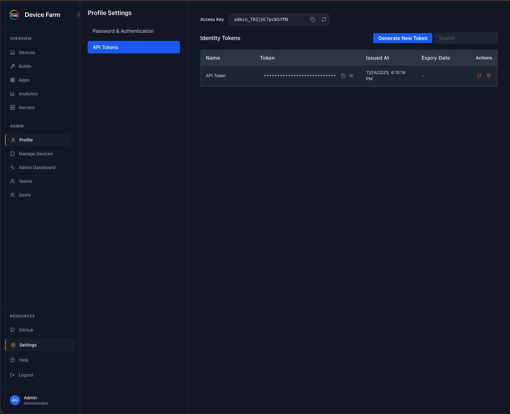

## Prerequisites

- **Appium** version 3.X
- **Node.js** >= 22.0.0
- **PostgreSQL** >= 12 (for Hub-Node architecture)
- **Appium drivers** installed (`uiautomator2`, `xcuitest`)

### iOS Real Device Testing

For iOS real device testing, Device Farm supports two methods:

1. **Default: `xcrun devicectl`** (Apple's native tool)
   - Automatically used if `GO_IOS` is not set
   - Requires Xcode and iOS development tools to be installed
   - No additional configuration needed
   - Works on macOS systems

2. **Optional: go-ios** (for non-macOS systems or if you prefer to use go-ios)
   - Download and install go-ios from [https://github.com/danielpaulus/go-ios](https://github.com/danielpaulus/go-ios)
   - Set the `GO_IOS` environment variable to the path of the go-ios binary:
     ```bash
     export GO_IOS=/path/to/go-ios
     ```
   - Or add it to your shell profile (`.bashrc`, `.zshrc`, etc.):
     ```bash
     echo 'export GO_IOS=/path/to/go-ios' >> ~/.zshrc
     source ~/.zshrc
     ```
   - **Note**: If `GO_IOS` is set, Device Farm will use go-ios instead of `xcrun devicectl` for iOS real device communication.

## Installation - Hub(orchestrator)


```
npm install -g farm-orchestrator
```

## Installation - Node(runner) 

```
npm install -g farm-runner
```

## Start the Hub

Set up your database and start the orchestrator:

```bash
# Database Credentials
export DB_HOST=localhost
export DB_USER=postgres
export DB_PASSWORD=secret
export DB_NAME=device_farm

# Optional: Override default admin credentials
export DEFAULT_ADMIN_USERNAME=your_admin_username
export DEFAULT_ADMIN_PASSWORD=your_admin_password

# Start Hub
farm-orchestrator
```

_Hub is now running at `http://localhost:3000`_

### First-Time Login

After starting the hub, you need to log in as an admin to generate API tokens for node connections:

1. Navigate to `http://localhost:3000` in your browser
2. Use the default credentials (or your custom credentials if you set environment variables):
   - **Username**: `admin@device-farm.org`
   - **Password**: `Admin@123`

!!! note "Default Credentials"
    If you didn't set `DEFAULT_ADMIN_USERNAME` and `DEFAULT_ADMIN_PASSWORD` environment variables, the default credentials are:
    - Username: `admin@device-farm.org`
    - Password: `Admin@123`

## Start a Node

To connect a machine with devices to the hub, you need the `accessKey` and `token` from the hub. These credentials are required for the runner to connect to the orchestrator.

### Getting Access Key and Token

1. Log in to the hub dashboard at `http://localhost:3000` using the admin credentials
2. Click on your profile name in the header
3. Navigate to **Profile → API Token**
4. The access key will be displayed above the API tokens table
5. Click "Generate Token" to create a new API token
6. Copy both the access key and the generated token

<div style="display: flex; justify-content: center; margin: 20px 0;">
    
</div>

### Configuring the Node

1.  Create `node.config.json`:
    ```json
    {
      "hubUrl": "http://localhost:3000",
      "accessKey": "your-access-key-from-profile",
      "token": "your-generated-token",
      "name": "My-Mac-Mini",
      "platform": "both"
    }
    ```
2.  Run the node:
    ```bash
    farm-runner -c node.config.json
    ```


To reflect the test status on dashboard. 

WDIO
```
      await driver.executeScript('devicefarm: setSessionStatus', [
        {
          status: 'passed', //passed or failed
        },
      ]);
```


To reflect the test name on dashboard.

WDIO 
```
      await driver.executeScript('devicefarm: setSessionName', [
        {
          name: 'Test Name',
        },
      ]);
```
